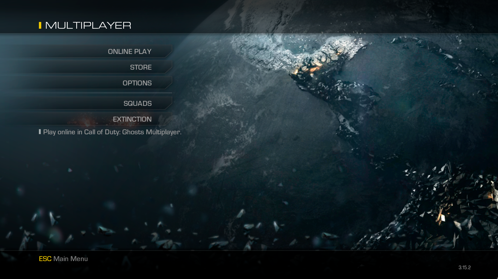
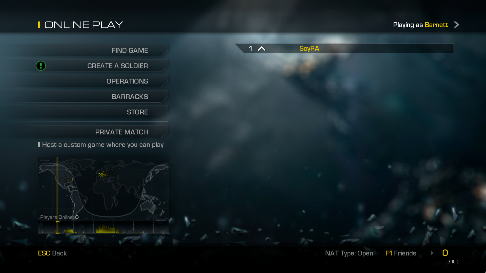
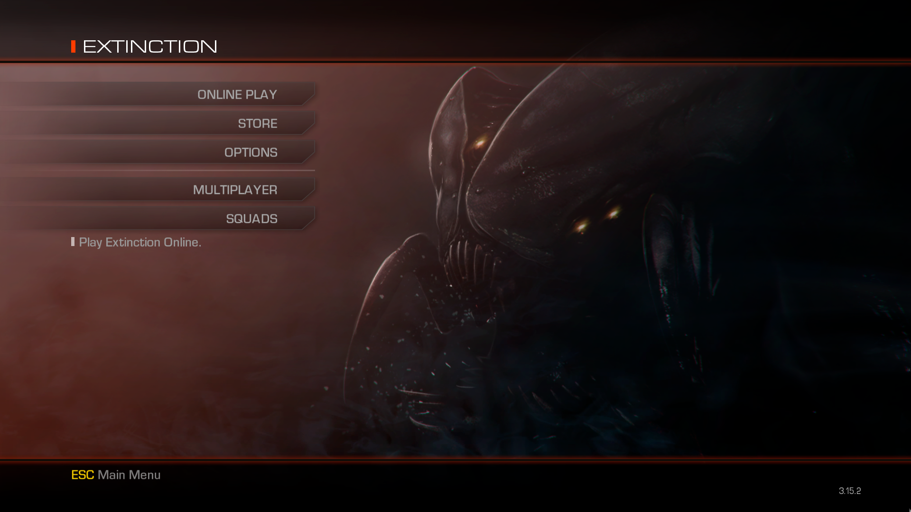
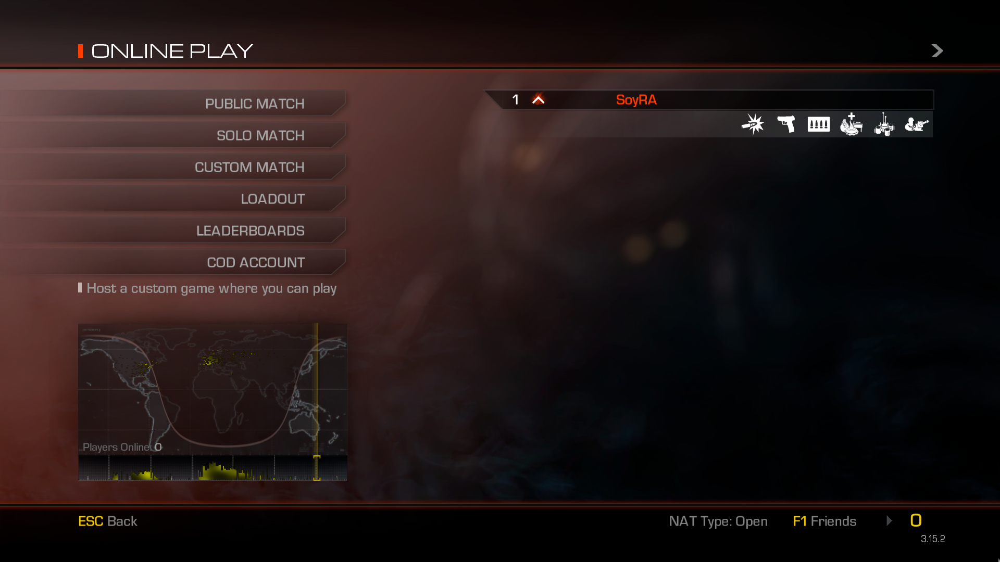
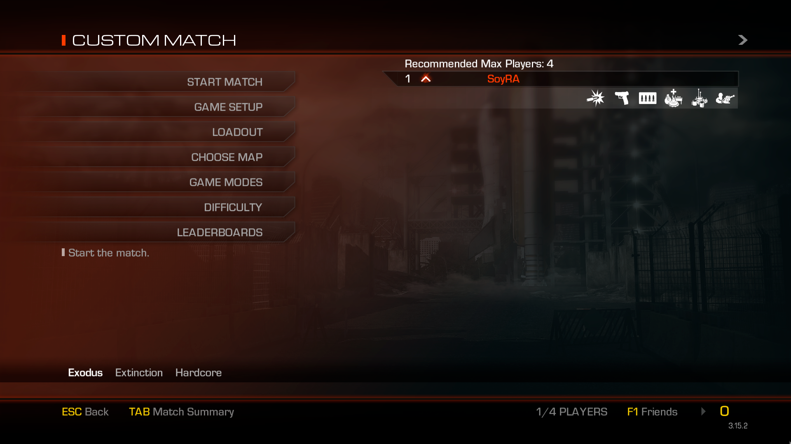

# PlusMaster (PlusIW6)
  
- **PlusIW6** es el proyecto de **PlusMaster** para poder jugar al **Call of Duty: Ghosts** (con el nombre en clave (oficial) de **IW6**).

## Aviso
- Este repositorio no contiene ningún código de PlutoT6, tan solo proporciona soporte y ayuda a los usuarios de habla hispana.
- **PlusIW6** se encuentra en **Alfa**, así que podrás encontrar muchos fallos. Además de que todo lo que leas aquí, puede quedar obsoleto muy rápido.
  - En dicho caso, te recomiendo visitar su **Discord** para estar atento a las últimas actualizaciones y todo. :P

## Tabla de Contenidos
- [Inicio](../../wiki)
- [Cliente](../../wiki/Cliente)
- [Preguntas Frecuentes](../../wiki/Preguntas-Frecuentes)
- [Solución de problemas](../../wiki/Soluci%C3%B3n-de-problemas)
- [Lista de Archivos](../../wiki/Lista-de-Archivos)
- [Enlaces de PlusMaster / PlusIW6](#enlaces-de-plusmaster--plusiw6)
- [Enlaces importantes de CoD: G](#enlaces-importantes-de-cod-g)
- [Imágenes de PlusIW6](#imagenes-de-plusiw6)

## Enlaces de PlusMaster / PlusIW6
**[`^        VOLVER ARRIBA        ^`](#tabla-de-contenidos)**
- [PlusMaster's Website](http://www.plusmaster.pro/) - Sitio web oficial de PlusMaster.
- [PlusMaster's Forum](http://www.plusmaster.pro/forum/) - Foro oficial de PlusMaster.
- [PlusMaster's Discord](http://discord.gg/w48zeR2) - Discord oficial de PlusMaster.
- [PlusIW6's Wiki](https://github.com/SoyRA/PlusIW6/wiki) - Wiki no oficial (en español) de PlusIW6. Donde encontrarás casi todo lo que necesitas.

## Enlaces importantes de CoD: G
**[`^        VOLVER ARRIBA        ^`](#tabla-de-contenidos)**
- [Manual](https://www.callofduty.com/content/dam/atvi/callofduty/ghosts/manuals/Ghosts-Manual-PC-es.pdf)
- [Discusiones](https://steamcommunity.com/app/209160/discussions/)
- [Guías](https://steamcommunity.com/app/209160/guides/)
- [PCGamingWiki](https://pcgamingwiki.com/wiki/Call_of_Duty:_Ghosts)

## Imagenes de PlusIW6
**[`^        VOLVER ARRIBA        ^`](#tabla-de-contenidos)**

