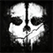
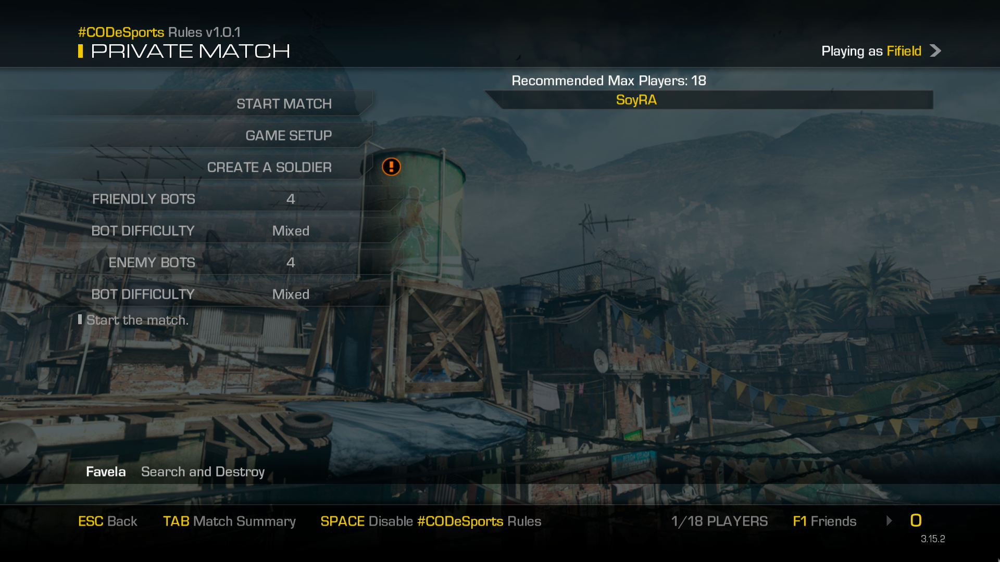

# PlusMaster (PlusIW6)
  
- **PlusIW6** es el proyecto de **PlusMaster** para poder jugar al **Call of Duty: Ghosts** (con el nombre en clave (oficial) de **IW6**).

## Aviso
- Este repositorio no contiene ningún código de PlusIW6, tan solo proporciona soporte y ayuda a los usuarios de habla hispana.
- **PlusIW6** se encuentra en **Alfa**, así que podrás encontrar muchos fallos. Además de que todo lo que leas aquí, puede quedar obsoleto muy rápido.
  - En dicho caso, te recomiendo visitar su **Discord** para estar atento a las últimas actualizaciones y todo. :P

## Tabla de Contenidos
- [Inicio](../../wiki)
  - [Características](../../wiki#características)
  - [Guía de instalación de PlusIW6](../../wiki#guía-de-instalación-de-plusiw6)
  - [Pedir ayuda](../../wiki#pedir-ayuda)
  - [Reportar un fallo](../../wiki#reportar-un-fallo-bug)
- [Cliente](../../wiki/Cliente)
  - [Requisitos](../../wiki/Cliente#requisitos)
  - [Proceso de Instalación](../../wiki/Cliente#proceso-de-instalación)
  - [Crear una partida](../../wiki/Cliente#crear-una-partida)
  - [Unirse a una partida](../../wiki/Cliente#unirse-a-una-partida)
- [Preguntas Frecuentes](../../wiki/Preguntas-Frecuentes)
  - [¿Qué versiones del juego puedo usar para jugar por PlusIW6?](../../wiki/Preguntas-Frecuentes#qué-versiones-del-juego-puedo-usar-para-jugar-por-plusiw6)
  - [¿Qué idiomas soporta PlusIW6?](../../wiki/Preguntas-Frecuentes#qué-idiomas-soporta-plusiw6)
  - [¿Necesito los DLCs?](../../wiki/Preguntas-Frecuentes#necesito-los-dlcs)
  - [¿Puedo tener el juego de Steam y PlusIW6 en la misma carpeta?](../../wiki/Preguntas-Frecuentes#puedo-tener-el-juego-de-steam-y-plusiw6-en-la-misma-carpeta)
  - [¿Puedo tener VAC o Game Ban por usar PlusIW6?](../../wiki/Preguntas-Frecuentes#puedo-tener-vac-o-game-ban-por-usar-plusiw6)
  - [¿Cómo puedo verificar mis archivos?](../../wiki/Preguntas-Frecuentes#cómo-puedo-verificar-mis-archivos)
  - [¿Hay Matchmaking, servidores dedicados o algo?](../../wiki/Preguntas-Frecuentes#hay-matchmaking-servidores-dedicados-o-algo)
  - [¿Debo abrir los Puertos?](../../wiki/Preguntas-Frecuentes#debo-abrir-los-puertos)
  - [¿Cómo puedo agregar amigos?](../../wiki/Preguntas-Frecuentes#cómo-puedo-agregar-amigos)
- [Solución de problemas](../../wiki/Soluci%C3%B3n-de-problemas)
- [Lista de Archivos](../../wiki/Lista-de-Archivos)
  - [PlusIW6](../../wiki/Lista-de-Archivos#plusiw6)
  - [CoD: G](../../wiki/Lista-de-Archivos#cod-g)
  - [DLC 1: Onslaught](../../wiki/Lista-de-Archivos#dlc-1-onslaught)
  - [DLC 2: Devastation](../../wiki/Lista-de-Archivos#dlc-2-devastation)
  - [DLC 3: Invasion](../../wiki/Lista-de-Archivos#dlc-3-invasion)
  - [DLC 4: Nemesis](../../wiki/Lista-de-Archivos#dlc-4-nemesis)
  - [DLCs Extras](../../wiki/Lista-de-Archivos#dlcs-extras)
  - [Checksums](../../wiki/Lista-de-Archivos#checksums)
- [Enlaces de PlusMaster / PlusIW6](#enlaces-de-plusmaster--plusiw6)
- [Enlaces importantes de CoD: G](#enlaces-importantes-de-cod-g)
- [Imágenes de PlusIW6](#imagenes-de-plusiw6)

## Enlaces de PlusMaster / PlusIW6
**[`^        VOLVER ARRIBA        ^`](#tabla-de-contenidos)**
- [PlusMaster's Website](http://www.plusmaster.pro/) - Sitio web oficial de PlusMaster.
- [PlusMaster's Forum](http://www.plusmaster.pro/forum/) - Foro oficial de PlusMaster.
- [PlusMaster's Discord](http://discord.gg/w48zeR2) - Discord oficial de PlusMaster.
- [PlusIW6's Wiki](../../wiki) - Wiki no oficial (en español) de PlusIW6. Donde encontrarás casi todo lo que necesitas.

## Enlaces importantes de CoD: G
**[`^        VOLVER ARRIBA        ^`](#tabla-de-contenidos)**
- [Manual](https://www.callofduty.com/content/dam/atvi/callofduty/ghosts/manuals/Ghosts-Manual-PC-es.pdf)
- [Discusiones](https://steamcommunity.com/app/209160/discussions/)
- [Guías](https://steamcommunity.com/app/209160/guides/)
- [PCGamingWiki](https://pcgamingwiki.com/wiki/Call_of_Duty:_Ghosts)

## Imagenes de PlusIW6
**[`^        VOLVER ARRIBA        ^`](#tabla-de-contenidos)**

